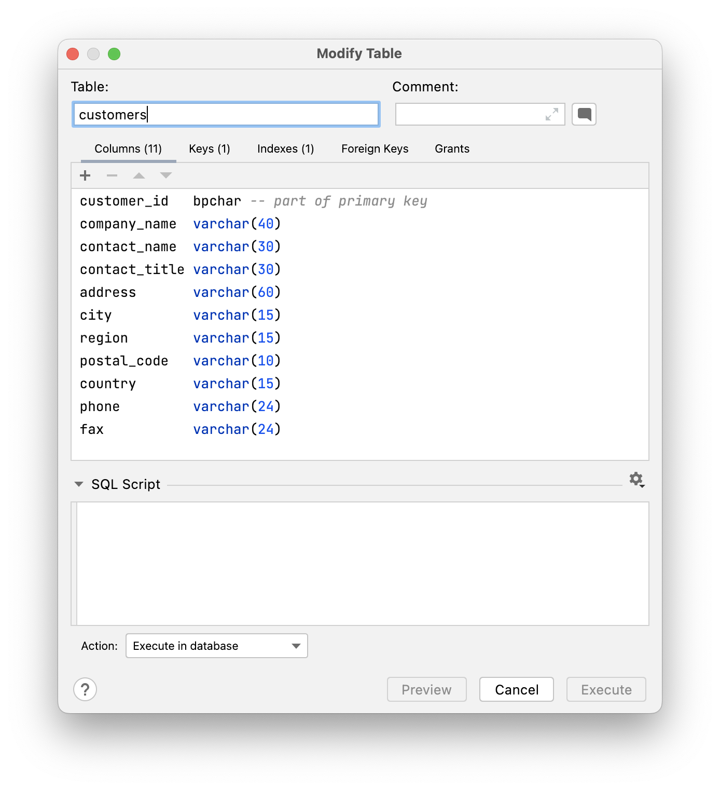
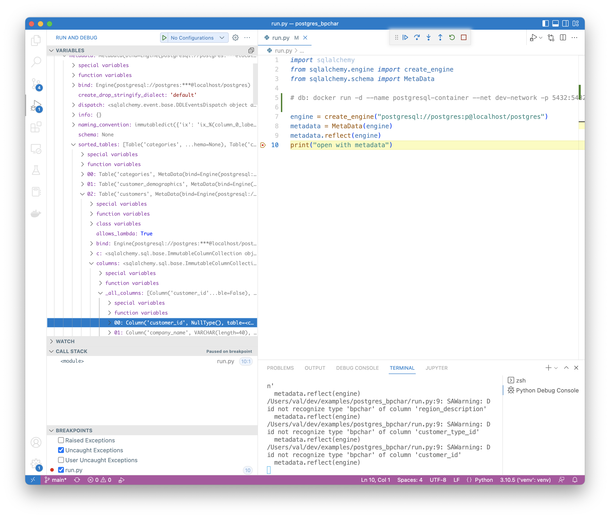

# Test Description

The following table uses `bpchar` for a datatype:

<figure></figure>

When running the `reflect` code, I get the following console log:

```
/Users/val/dev/examples/postgres_bpchar/run.py:7: SAWarning: Did not recognize type 'bpchar' of column 'customer_id'
```

The metadata sees this as `nulltype`:

<figure></figure>

# Questions

My questions are:

1. Is `bpchar` supported in the postgres dialect?
   * I thought that the dialect was inferred from the uri `postgresql`.
2. If not, how can I recover the original type?